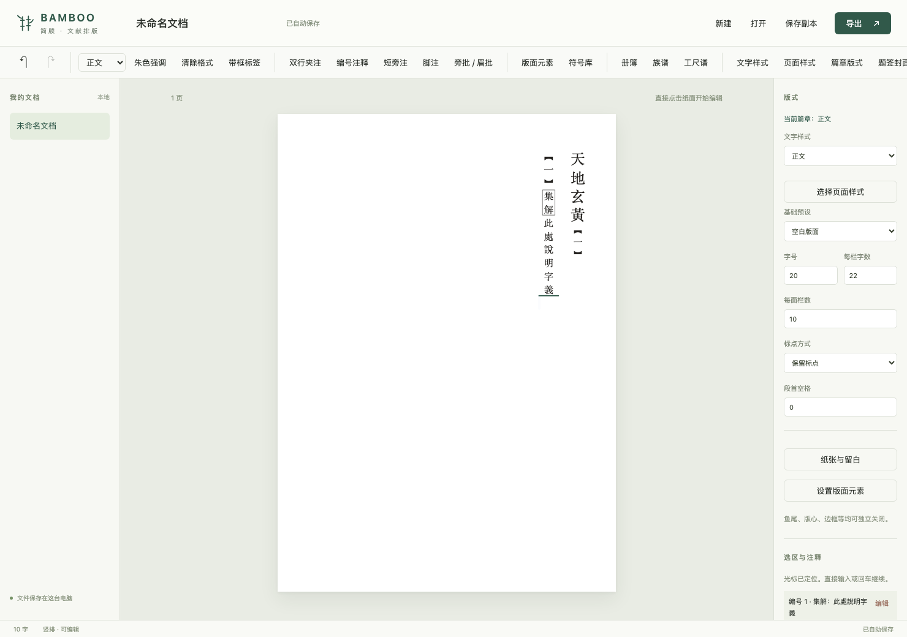
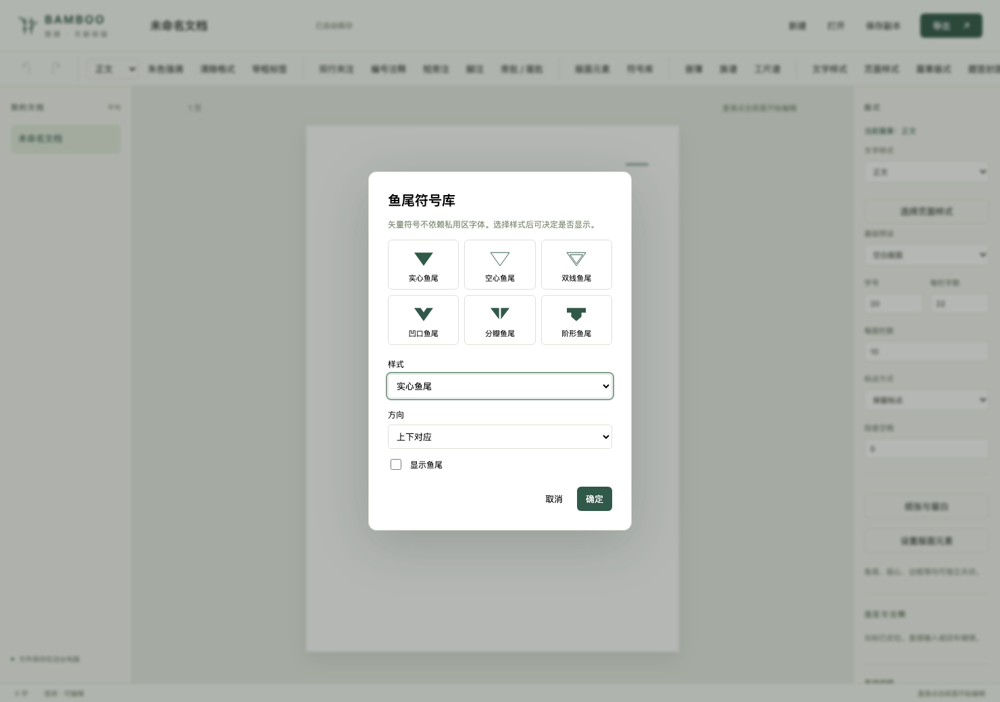
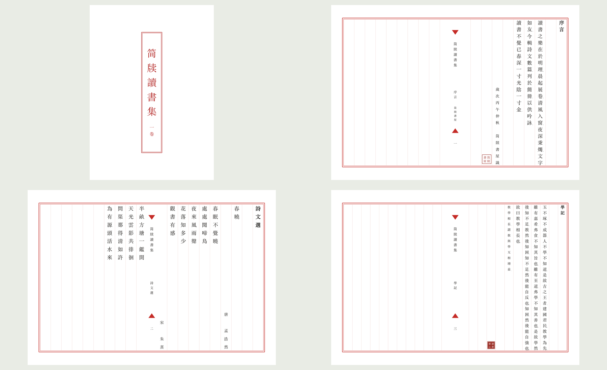
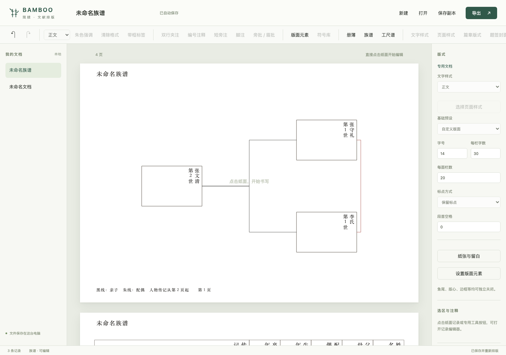
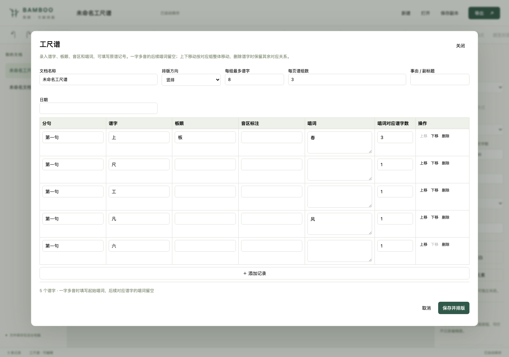
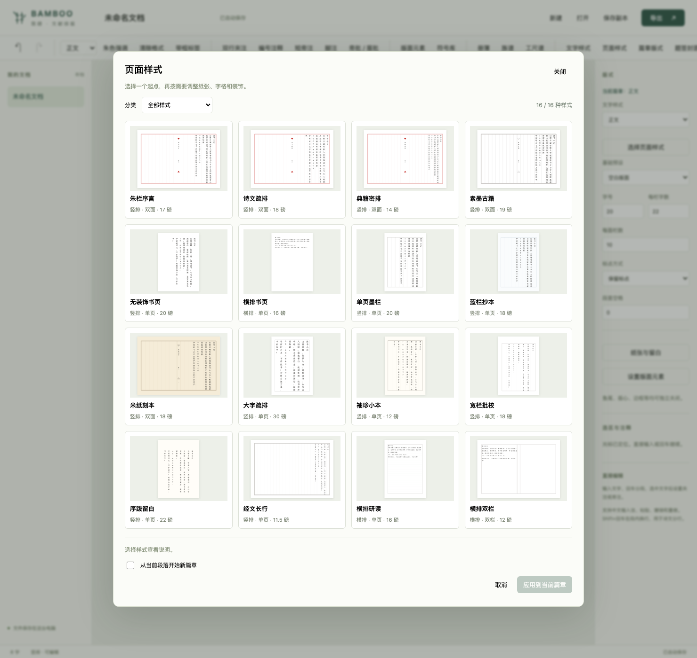

# Bamboo 简牍

Bamboo（简牍）是一个面向古籍与传统文书的编辑排版引擎，带有可直接操作的编辑界面。用户从空白文档开始，在纸面上输入、拖选文字、设置夹注或段后注，编辑后立即重排。PDF、HTML、DOCX 是导出格式，不是编辑入口。

**0.6.0 支持正文、册簿、族谱和工尺谱的直接编辑，不需要编写源文件。** 内核维护文档、光标、选区、编辑事务、注释关联和撤销历史。界面、导入器和导出器调用这套状态模型。



## 可选元素，不是固定模板

- 鱼尾、版心区域、版心边线、书名、卷次、页码、界栏、外框可以独立开关；“版面元素 → 全部关闭”得到纯文字版面。
- 横竖方向切换保留纸张、字号及元素选择，不会重新套用模板。
- 编号注释自动生成正文引用和随段注文，插入、删除后重新编号；点击引用可编辑或移除整条注释。
- “集解”“索隐”等注家标签的文字和边框分别可编辑。
- 内置 6 种自绘矢量鱼尾，每种支持上、下、左、右方向。默认不显示，也不依赖字体私用区码位。



现有“课注”功能正式命名为“段后注”，内部标识 `commentary` 保持不变，已有文档可以继续打开。

## 篇章与文字样式

同一本书可以组合题签封面、序言、诗文与正文。每篇独立设置横竖方向、纸张尺寸、界栏密度、版心书名、篇名、作者和起始页码。

- **文字样式**：内置正文、题名、篇章标题、序言、诗文、段后注、作者署名、题跋落款、引文和题签主副标题共 11 种。可修改字号比例、颜色、粗体、对齐和段前段后留白，也可另存新样式；修改会更新所有引用它的段落。
- **篇章版式**：提供 16 种可预览的页面样式，覆盖古籍双面、单页竖排和横排阅读。可从当前段落开始新篇，或撤掉分篇接续前文。
- **题签封面**：可编辑书名与卷次，边框可选无、单线、双线，题签宽度可调。
- **文字印章**：支持 1～16 字方印、朱文与白文，印文仍是文字；当前使用文档字体，不生成篆刻字形。
- **诗文分行**：`Shift+回车` 在段内换行，普通回车分段；诗文等正文类样式会延续到新段。
- **独立配色**：正文、强调与印章、外框、界栏、鱼尾、版心文字和纸色均可分别调整。



在界面中“打开” `examples/styles.json` 可得到这本可编辑样例，也可从空白文档直接使用上述工具，无需编写文件。

册簿用于分类记录事务；现代册簿并不因采用传统竖排而成为古籍。简牍把它作为独立文档类型，共用编辑与排版内核。

## 册簿

工具栏“册簿”打开专用记录编辑器，可增删、排序和修改姓名、金额、物品、日期及备注。点击纸面上的记录也可回到对应字段。横排使用原生表格，竖排以自右向左的记录列呈现，文字方向在三种导出中保留。

金额使用精确小数，自动生成大写金额、每页小计和总计。保存、撤销、刷新恢复及 JSON 副本均保留结构化记录。Word 使用可编辑表格及带标识的文字字段；回导时读取实际记录并重新计算金额。Word 内改字造成重新分页后，小计仍对应原来的记录分组，需要回导重新排版。

可在界面中打开 `examples/register.json` 体验两页竖排册簿。


## 族谱

工具栏“族谱”录入姓名、生卒信息和传记，通过人物选择框设置父母、配偶。自动校验关系、计算世代并生成世系图：黑线表示亲子，朱线表示配偶，跨页关系注明续接页码。每张图的人数可以调整，后附每个人物的传记页。

PDF/HTML 使用共享几何图形；Word 使用可编辑人物框、原生连线形状及传记表格。修改人物记录后重排可更新图形；Word 内直接拖动连线不会改变亲属数据。回导读取人物字段，兼容图框或传记中的姓名修改；两处同时改成不同姓名时会提示核对。

可打开 `examples/genealogy.json` 查看三代、含跨页关系的样例。



## 工尺谱

工具栏“工尺谱”录入分句、谱字、板眼、音区标注和唱词。常用谱字提供候选，也可填写原谱中的自定义记号。设置“唱词对应谱字数”即可表达一字多音；对应组会整体移动，删除其中的谱字时会调整剩余唱词关系。

支持横排、竖排、每组字数与每页组数设置，增删后自动重新分组分页。PDF/HTML 共用谱字与唱词几何位置，Word 以原生表格和合并单元格保留对应关系，回读实际唱词、谱字与合并跨度。

可打开 `examples/gongche.json` 查看五句、两页的排版示例；示例不对应真实曲目。板眼记号依原谱填写，当前功能不推断调律、速度、演奏时值或音频，Word 内大幅调整合并结构后需要核对。



## 页面样式库

点击工具栏“页面样式”或右侧“选择页面样式”，先看缩略预览，再应用到当前篇章。勾选“从当前段落开始新篇章”可保留前文版式。应用后仍可独立调整元素、字号、纸张和配色，并支持撤销。



| 类别 | 样式 |
| --- | --- |
| 古籍双面 | 朱栏序言、诗文疏排、典籍密排、素墨古籍、米纸刻本 |
| 单页竖排 | 无装饰书页、单页墨栏、蓝栏抄本、大字疏排、袖珍小本、宽栏批校、序跋留白、经文长行 |
| 横排阅读 | 横排书页、横排研读、横排双栏 |

本次新增 10 种样式，各自在开本、行栏数、字号、留白或装饰上有所区别。宽栏批校为注文留出更多空间，仍需根据具体批注长度调整；横排双栏使用原生双栏文字流。

通过“打开”载入 `examples/page-styles.json` 可查看全部 16 种样式的可编辑选集。预览使用独立示例文字，选择样式只改变当前篇章的版面设置。

## 安装与使用

需要 Python 3.9 或更新版本：

```sh
python -m venv .venv
source .venv/bin/activate
python -m pip install -e '.[test]'

bamboo edit
```

也可以直接执行 `bamboo` 或 `python -m bamboo edit`。启动后打开本地编辑界面，默认地址为 `http://127.0.0.1:8765`。

## 在界面中使用

1. 点击“新建”，直接点击纸面输入文字。支持中文输入法、回车分段、删除、粘贴和跨段选区。
2. 拖选文字，设置朱色强调、双行夹注或短旁注；通过段落样式选择题名或随段段后注。
3. 在右侧调整版式、字号、字格与标点；可以切换横排和竖排。
4. 使用撤销、重做，或 `Ctrl/⌘ Z`。文档自动保存在本机，刷新后恢复。
5. “打开”支持普通 UTF-8 文本、Word 文档和编辑器保存的副本；“导出”支持 PDF、HTML、原生 Word。

工具栏的“编号注释”“带框标签”“版面元素”“符号库”提供对应编辑入口。预设只是可选起点，调整参数后会显示为自定义版面。

“保存副本”下载可恢复的编辑状态 JSON。它只是文件载体，用户无需手写或理解其中的结构。

```sh
# 不自动打开浏览器，指定端口与本地文档目录
bamboo edit --no-browser --port 8765 --workspace output/editor
```

服务仅监听本机回环地址，不是公网或多人协作服务。文档默认保存在 `output/editor/documents`。停止服务后可以用同样的目录重新启动；撤销历史保留在当前服务会话中，文档内容和光标位置保存到磁盘。

## 不依赖界面的编辑 API

```python
from bamboo import EditorSession, Position

editor = EditorSession()  # 真正的空白文档，不读取源文件
editor.dispatch({"type": "insert_text", "text": "山窗日暖\n竹影入帘"})
editor.select(Position(editor.block_ids[0], 0), Position(editor.block_ids[0], 4))
editor.dispatch({"type": "format_range", "kind": "note"})
editor.dispatch({"type": "undo"})

layout = editor.layout()                 # 当前文档的布局
position = editor.hit_test(0, 410, 80)    # 纸面坐标 -> 文档位置
caret = editor.caret(position)           # 文档位置 -> 光标几何
```

一次 `dispatch([...])` 是原子事务，只产生一个撤销步骤。可传入 `expected_revision` 防止旧界面覆盖新编辑。文本插入、删除、分段或合并时会更新独立批注的锚点；删除锚点与所附批注可以整体撤销。排版冲突不会丢弃输入，而是返回诊断。

## 批处理与开发工具

原来的文本语法和 `render` 命令仍可用于自动化、样例与测试，**不是普通用户编辑文档的必要步骤**。已有依赖环境时，可在项目根目录执行 `python -m bamboo render`。一次导出生成 PDF、HTML、DOCX、布局 JSON 和 manifest。

```sh
# 横排正文、双行夹注与随段段后注
bamboo render examples/horizontal.bamboo -o output/horizontal --name horizontal

# 朱色短旁注、长旁批、眉批和段后注
bamboo render examples/annotations.json -o output/annotations --name annotations

# 单面朱丝栏
bamboo render examples/custom.json -o output/custom --name custom

# 编号引用与注家标签
bamboo render examples/numbered.json -o output/numbered --name numbered

# 只导出原生 Word
bamboo render examples/daodejing.bamboo --formats docx --docx-mode flow -o output/word

# 可选整页图片模式，不支持正文重排
bamboo render examples/daodejing.bamboo --formats docx --docx-mode facsimile --dpi 300 -o output/facsimile

bamboo presets
bamboo layout examples/custom.json > custom.layout.json
python -m pytest -q
```

## 格式与一致性

Word 默认导出可编辑、可重排的原生文字，横排保持横排，竖排保持竖排。可选图片模式仅用于明确需要整页图像的场景。

| 能力 | PDF / HTML | DOCX 默认流式模式 |
| --- | --- | --- |
| 横排与竖排 | 共用确定的字位布局 | 原生横排或竖排，保留纸张尺寸 |
| 正文、题名与缩进 | 矢量字或 SVG 文字 | 原生段落、标题样式、字距与行距 |
| 双行夹注 | 双行小字，支持跨栏跨叶 | 原生双行合一，随正文重排 |
| 段后注 | 随段独立小字号注文 | 独立段后注样式，与前段保持关联 |
| 短旁注 | 正文旁的独立小字 | 原生 ruby，与锚定文字一同流动 |
| 编号引用与注文 | 引用与注文绑定、自动重编号 | 原生中文编号列表＋书签＋REF 域回链 |
| 注家标签 | 可编辑文字、可选方框 | 原生文字样式与字符边框 |
| 长旁批、眉批 | 独立区域、源锚点、局部避碰与越界校验 | 可编辑文字框，跟随段落或所在页面 |
| 脚注 | 当前以随文双行小注表达 | 原生页下注、自动编号和脚注关系 |
| 版框、界栏、版心、鱼尾 | 矢量装饰 | 独立页眉装饰图层，正文仍然是文字 |
| 篇章与混合纸张 | 每篇独立分页、方向与尺寸 | 原生分节，各节独立方向和尺寸 |
| 复用文字样式 | 样式更新后重排所有引用段落 | 原生段落样式与直接格式 |
| 题签封面 | 文字与矢量框 | 独立封面节、可编辑文字框 |
| 文字印章 | 小字与矢量方框 | 行内文字框，随正文移动 |
| 叶码 | 排版时计算 | 原生 PAGE 字段，随重排更新 |

PDF 与 HTML 共用固定布局。DOCX 使用相同的方向、纸张、字体、字号和网格目标，但最终换行与分页由阅读器计算，不能保证任意修改后与 PDF 逐字同位。双面竖排的版心通过页眉环绕对象留出；Word 行框环绕需要小幅行距容差，详见架构说明。

题签与印章在 Word 中保留为文字框。Bamboo 会在编辑后重新计算题签字号；在 Word 内大量增字时需要手动调整文字框。实际验收使用 LibreOffice 与 Chromium，尚未逐一验证各版本 Word/WPS 的文本框细节。

**长批注的边界：** 短旁注原生随字移动；长旁批使用段落相对定位文字框。增删前面的段落时可以跟随所在段落移动；在锚定段落内部大量改字之后，需要重新从源文导出以更新精确位置。文字框不能自动跨页续框，导出警告会明确说明。

## 批处理辅助格式（可选）

```text
@title 竹窗读书记
@volume 卷一
@preset single

# 读书小记

　　山窗日暖，竹影入帘。[[小字双行，随文排入。]]展卷读书，{{心与古人相接。}}

> 段后注：本段先写景，再说读书的感受。段后注跟随前段，使用小字表达。

后文仍然保持竖排((此处为 Word 原生脚注的示例。))。

---

此处明确另起一页。
```

- 元数据在正文之前。模板有 `woodblock`、`red-ruled`、`single`、`horizontal`。
- `@writing-mode vertical-rl` 或 `horizontal-tb` 明确方向。只指定横排方向而未指定模板时，采用横排模板。
- `# ` 至 `######### ` 表示分级题名；空行结束段落，普通换行仅用于编辑源文件。
- 段首全角空格表示字格缩进。`[[…]]` 是夹注，`{{…}}` 是重点文字，`((…))` 是脚注。
- `> ` 是随段段后注，连续 `>` 可记录段后注层级。
- 单独一行 `---` 是分页。首尾或连续分页符不生成空白页。
- 使用反斜线转义标记，不支持嵌套行内标记。

短旁注和独立批注使用 JSON：

```json
{
  "title": "评读小记",
  "preset": "single",
  "blocks": [{"inlines": [
    {"text": "学而时习之", "kind": "ruby", "annotation": "温故知新"},
    {"text": "读书须知先后"}
  ]}]
}
```

完整配置见 [朱批示例](examples/annotations.json)。长批注通过 `block`、`inline`、`offset` 锚定源文字，指定 `placement`、`columns`、`extent`，不写死全局页码。空间不足时明确报错，不裁掉注文。

## 底层布局与导出 API

```python
from bamboo import Book, Block, Inline, PRESETS, compose, render

book = Book(
    title="竹窗读书记",
    blocks=(
        Block((Inline("读书小记"),), kind="heading", indent=1),
        Block((Inline("山窗日暖，"), Inline("小字双行。", kind="note"), Inline("竹影入帘。"))),
        Block((Inline("段后注：此段从景物引入读书之乐。"),), kind="commentary"),
    ),
    profile=PRESETS["single"],
)
layout = compose(book)
result = render(book, "output", basename="bamboo")
print(result.pages, result.files)
```

还提供 `parse(text)`、`load(path)`、`from_dict(data)` 和 `Annotation` 模型。模型不可变，坐标为 pt，原点在左上角。`columns` 表示每个排版面的行／栏数，`rows` 表示每行／栏的主字格数，按横竖方向对应的写作轴解释。

## 字体与诊断

```sh
bamboo render examples/daodejing.bamboo --font /path/to/font.otf
bamboo render examples/daodejing.bamboo --font /path/to/fonts.ttc --font-index 0
```

也可设置 `BAMBOO_FONT`。未指定时探测本机宋体、Noto Serif CJK、文鼎明体，最后使用内置 CJK 字体。字体不放入源码；PDF、HTML 和 Word 流式文档嵌入所用字形。在 Word 中新增子集以外的字，仍需本机字体支持。

缺字、无效参数、批注超容量、文字越界和不允许的字体嵌入会返回明确错误。禁止子集化的字体保留完整数据；仅允许预览打印嵌入的字体不能用于可编辑 Word。

manifest 的 `pages` 指固定布局页数，DOCX 实际页数以阅读器渲染为准。`warnings` 记录跨格式差异。Word 包内 `customXml/bamboo-source.xml` 保存原始语义快照；在 Word 直接改字不会自动回写这个快照。

## 设计与验证

- [编辑内核与界面](docs/editor.md)：编辑状态、事务、光标、锚点、输入法和保存恢复。
- [架构](docs/architecture.md)：语义、主文字流、注释区域与导出。
- [特殊版式能力](docs/typography.md)：各种注释的表达方式与当前边界。
- [验证记录](docs/validation.md)：实际渲染、方向保持和增删重排测试。

当前布局按版本缓存并报告变化页面，尚不是完整的增量分页算法；长文性能、复杂对象操作、多用户协作和任意 Word 文件的高保真导入还需完善。Word 导入以实际正文为准，支持常规段落、题名、双行夹注、短旁注和脚注；复杂表格只保留行文字，浮动批注文字转为段后注，界面会提示差异。

尚未实现完整多语种 shaping、全部中文标点禁则、图像印章叠印、自动抬头包边、通用复杂表格编辑和印刷折手。样例使用独立测试正文与公开古文节选，不作为校勘底本。
