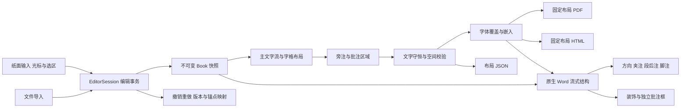

# Bamboo 排版引擎架构

## 核心约定

编辑器首先维护可持续编辑的文档状态。`EditorSession` 接受输入、选区和格式命令，提交不可变文档快照，再计算版面。文件导入只是创建会话的一种方式。方向是文档属性，主文字流和各类注文保持各自结构。

PDF 与 HTML 消费相同几何布局。DOCX 消费语义文档和版式参数，使用 Word 段落及重排机制；不把固定页上的每个字做成孤立文本框。

## 模块

| 模块 | 职责 |
| --- | --- |
| `editor.py` | 编辑会话、稳定段落标识、事务、选区、历史、锚点、布局缓存与命中测试 |
| `webapp.py` / `web/` | 本地界面适配器、直接纸面输入、中文输入法、自动保存与导出入口 |
| `importers.py` | 普通文本与 Word 实际正文导入，不让旧快照覆盖用户修改 |
| `structured.py` | 册簿、人物关系、工尺谱的类型约束和精确金额计算 |
| `structured_layout.py` | 专用表格、世系图、谱字唱词合并与分页几何 |
| `exporters/structured_word.py` | 原生 Word 表格、人物框、连线及标记字段回读 |
| `model.py` | 书、方向、版式、段落、行内内容、独立批注和布局原语 |
| `parser.py` | 源文标记、严格 JSON 导入，拒绝未知字段 |
| `layout.py` | 按写作轴排字、双行夹注、分页、版心与文字守恒 |
| `annotations.py` | 独立注释区域、局部避碰和越界检测 |
| `fonts.py` | 字体选择、缺字、嵌入权限、子集与统一基线 |
| `exporters/wordflow.py` | 原生 Word 正文、网格、双行合一、段后注、ruby、脚注和批注框 |
| `exporters/docx.py` | Word 封装、字体、页眉装饰、源文快照与可选图片模式 |
| `exporters/pdf.py` | 矢量文字、界栏、鱼尾与书签 |
| `exporters/html.py` | 离线 SVG 阅读器与可复制原文 |
| `engine.py` | 导出编排、暂存、警告、摘要和交付路径 |

## 文档与布局协议

`Book` 保存书名、卷名、作者、版式、有序段落和独立批注。`writing_mode` 取 `vertical-rl` 或 `horizontal-tb`。`line_advance` 是行／栏距，`cell_advance` 是文字沿行内方向的字格进距。竖排双面从右面进入左面，横排分面从左面进入右面。

`Block` 区分正文、题名、段后注、分页符，保留缩进和层级。`Inline` 区分普通文字、重点、夹注、短旁注和脚注。短旁注的 `text` 是基文，`annotation` 是注文。`Annotation` 保存长旁批或眉批的源锚点与区域容量。

偏移使用 Python Unicode 码点索引，不是 UTF-8 字节或 JavaScript UTF-16 下标。组合符与异体选择符附着于前字。批注必须锚定实际显示的字素起点。

布局 JSON 为 `schema_version=1`，新增字段保持旧输入可读。页面包含 glyph、线段、多边形与批注区域。正文 glyph 保留源位置，装饰及独立注文使用不同角色。固定布局经过独立源字集合校验，不静默丢字或重复字。

## 注释与重排

双行夹注占用主文字流中的空间，使用半字号的两条小字流，跨栏续排并平衡末段。段后注另起小字号段落，与前段关联。短旁注使用基文与注文配对，在 Word 中以 ruby 表达。

独立长批注在主文字布局完成后定位，局部避碰，越界或与正文冲突时失败。它不是全局最优化避碰器，也不自动改写正文以腾空间。

Word 长批注是可编辑文字框。竖排框的定位轴与页面物理轴不同，导出器显式转换。长旁批采用段落相对位置，眉批采用锚点所在页的顶部位置；前置段落增删后可以迁移。对同一锚定段落内部的修改，需重新导出更新精确字位；当前不自动跨页续框。

## Word 导出契约

- 正文使用 `w:p` / `w:r`，节的 `w:textDirection` 保持横竖方向，不互换纸张宽高。
- 网格、字号、字距、精确行距表达目标版式。不依据固定分页结果插入自动分页或换栏符。
- 夹注使用 `w:eastAsianLayout combine`，短旁注使用 `w:ruby`，段后注使用独立样式与 `keepNext`。
- 脚注使用标准部件、正文引用和编号，分页由阅读器处理。
- 版框、界栏和鱼尾是独立页眉装饰，正文不栅格化；叶码使用 PAGE 字段。
- 双面竖排用重复环绕对象留出版心。对象覆盖完整页面高度，避免末字流入底部缝隙。为兼容阅读器行框留白，Word 的双面竖排行距最多缩小 0.4pt，源文与字号不变。
- 字体以标准混淆字体部件嵌入，源文快照独立保存。Word 中的实时修改与源文快照不是同一个对象。

Word 的标点规则、ruby 宽度和字体度量仍可能改变分页。manifest 说明页数统计范围，并报告长批注、脚注等已知差异。不能以“有合法 OOXML”代替实际渲染。

## 可靠性

全部格式先在暂存目录完成，再逐文件替换，manifest 最后写入。单文件替换原子，不提供跨文件事务或同名并行构建锁；文件摘要用于识别部分替换与后续修改。

输入、字体和空间错误返回 `BambooError`，CLI 输出错误 JSON 并返回退出码 2。固定几何结果可复现，PDF/ZIP 封装字节不承诺完全一致。

## 篇章版式和复用样式

`styles.py` 解析继承的篇章上下文和文字样式。`compose` 按篇章调用排版器，将块索引、旁注标识和坐标重新映射至全书，并保留每页的 Profile、物理页序和显示页码。`style_layout.py` 提供题签和方印的几何结构。

DOCX 使用原生分节承载混合方向和尺寸，各节页眉独立设置。`wordstyles.py` 映射段落样式、题签文字框和行内方印；这些内容不会将正文转成图像。Word 最终分页仍由阅读器决定，Bamboo 的固定页码只是 PDF/HTML 的排版结果。

## 自动续批与 Word 量化

批注保留原始锚点，各片段保存批注文字偏移和分段序号。固定批注及短旁注先占位；短续排批注优先靠近原文，较长批注随后使用剩余栏间区域。新页可只含续批。独立校验覆盖每个批注原始字符，禁止重复和遗漏。

Word 的字体与字距采用半磅及 twip 单位，字距向下量化以避免一行少一个字。单面竖排补偿字体框在末栏的额外宽度，保持字墨从右页边距起算，减少少一栏及错页。密集续排框采用页内定位；普通定区域旁批保留原有定位方式。
