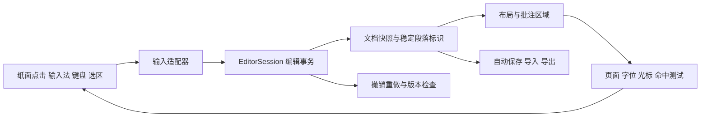

# 编辑内核与交互界面

## 编辑入口

Bamboo 的主操作对象是 `EditorSession`，不是某种源文件。空白会话包含一个真实的空段落，可以直接输入。浏览器只是输入与显示适配器，编辑命令、历史、锚点和布局映射都在可独立使用的 Python 内核中。



## 文档与位置

内核用不可变 `Book` 作为快照，在会话中为每个段落保存稳定标识。光标位置由 `block_id` 和 Unicode 码点偏移组成；选区保存方向明确的 anchor / focus。布局中的字位可以反查文档位置，文档位置也可以查询光标线。

空白段落有布局起点，没有伪造的占位文字。组合字符和异体选择符作为字素边界处理；界面使用内核返回的边界，不将 UTF-16 索引误当成码点偏移。

## 编辑事务

当前命令包括文字插入、选区替换、前后删除、分段、跨段合并、行内格式、段落属性、版式、文档元数据、注释增删、撤销和重做。

命令组在草稿中执行，全部通过结构验证后才提交。失败不会产生半完成文档或撤销记录。事务可以携带期望版本；版本冲突时明确拒绝，不覆盖另一份更新。

分段保留前段标识，为后段分配新标识；合并保留首段标识。编辑操作同时映射批注锚点：前方插字向后移动锚点，段落拆分迁移到相应段落，删掉锚点则将所附批注作为同一事务删除，撤销可以完整恢复。

短旁注基文内部的文字修改保留其注文。会拆开一组短旁注的结构操作被明确拒绝，用户可以先将整组转为普通文字再调整。

## 布局与诊断

布局按文档版本缓存，返回当前页面、字位、段落起点、变化页面列表和问题。当前内部仍执行全文分页；变化页列表是缓存失效结果，不应描述成已经实现完整的增量分页。

编辑与排版错误分开：批注区域冲突时，刚输入的文字仍会提交和保存，界面显示问题并显示可排出的正文。缺字会保留输入并提示字体问题。导出仍执行严格字体和布局校验，不以残缺输出冒充成功。

## 输入与界面

纸面使用内核产生的 SVG 字位。点击定位光标，拖动建立选区，输入通过隐藏的浏览器文字输入控件接收，再转换为编辑命令；用户操作的是页面，不需要打开源码文本框。

输入法组合期间不发送编辑事务，确认候选后只提交一次。普通快速输入按序提交；后续文字跟随上一事务结果的光标，避免异步响应将字符顺序打乱。

界面包含新建、打开、保存副本、导出、撤销重做、题名与课注样式、夹注、短旁注、脚注、独立旁批／眉批、横竖方向和版式参数。失败的文字提交会显示可恢复文本，避免输入被错误提示吞掉。

## 保存与导入

服务在指定文档目录中自动保存会话，使用临时文件加原子替换。保存文件包含文档、段落标识、选区和版本。重启可以恢复这些状态；当前不将撤销历史写入持久文件。

普通文本直接作为文字导入，不解析标记。Word 导入读取文件中的实际正文，不用可能已经过期的内嵌源文覆盖用户在 Word 中的修改。可以复用有效的原版式参数，但正文始终来自实际 OOXML。

当前 Word 导入支持普通段落、分级题名、双行夹注、ruby 和脚注。复杂表格转为行文字，浮动批注文字转为随段课注，图片未转成可编辑对象；这些差异会在界面说明。完整 Word 兼容不是本版本的承诺。

## 服务边界

本地服务默认只监听 `127.0.0.1`，使用当前会话令牌及同源检查保护编辑接口。没有公网部署、协作合并或多用户授权功能。界面代码不执行导入文档中的脚本，导出只写入所选工作目录。

## 验证

```sh
python -m pytest tests/test_editor.py -q
BAMBOO_BROWSER_TEST=1 python -m pytest tests/test_editor_browser.py -q
```

浏览器检查使用 Playwright 与 Chromium，需在开发环境中安装它们。测试实际点击纸面输入、跨段选区、拖选添加短旁注、组合输入只提交一次、撤销重做、刷新恢复、文件打开和三格式下载，并检查无令牌请求、跨站请求和旧版本写入被拒绝。


## 文字样式与篇章

`TextStyle` 是可复用的文字样式，`Block.style` 按稳定 key 引用；`Book.styles` 可覆盖内置样式，也可添加新样式。命令 `apply_style` 应用到选区所及段落，`define_style` 修改定义并重排全部引用。字号以篇章正文字号为基准乘以 `font_scale`。`insert_linebreak` 保留段落身份，只插入段内换行；普通回车继续创建新段。

`Block.section` 表示篇章起点，`SectionSpec` 包含可继承的 Profile、版心信息、页码重启与页面类型。`set_section` 默认更新所在篇章，`new: true` 从光标所在段落另起一篇；`clear_section` 移除当前边界。`set_profile` 和 `set_direction` 默认作用于当前篇章，没有分篇时修改基础版式。显式 `scope: "document"` 修改基础 Profile，已有独立 Profile 的篇章仍保持自己的设置。

`insert_cover` 在文档前插入题签书名和可选卷次，原有正文的标识和版式保留。封面文字可直接点击编辑，通过“题签封面”按钮可调整边框和宽度。`insert_inline` 的 `kind: "seal"` 添加方印，`seal_style` 为 `red` 或 `white`。

页面输出携带自己的 `profile` 和 `section_index`；命中测试、光标方向、SVG 画布、打印纸张都采用所在页的尺寸与方向。UI 当前篇章由选区位置决定。

Word 回读使用实际正文、题签文字与印文，结合保留的样式定义和原生分节恢复篇章。没有完整支持任意第三方文本框、手工 Word 样式修改和外部装饰的逆向还原；恢复编辑状态以保存副本为准。


## 页面样式库

“页面样式”提供 16 张实际排版缩略图，可按古籍双面、单页竖排、横排阅读筛选。预览仅使用内置示例正文，不读取用户文档。选中卡片后点击应用，默认只更新当前篇章；也可从光标段落开始新篇章。关闭或取消不修改文档。题签封面使用单独的封面设置入口。

`GET /api/page-styles` 返回样式标识、说明、分类、Profile 与缩略图几何，需要编辑器令牌。缩略图通过实际排版内核生成，在服务内缓存。`page_style_presets()` 的返回结构保持兼容，现有 `set_section` 命令可直接使用全部样式标识。
